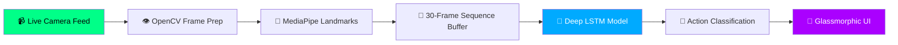

<div align="center">

# 🤟 SignSense-LSTM — Real-Time Sign Language Translation

[](https://git.io/typing-svg)


<br/>

[](https://signsense-lstm-project.streamlit.app/)
[](https://github.com/mayank-goyal09/SignSense-LSTM/stargazers)
[](https://github.com/mayank-goyal09/SignSense-LSTM/network)

<br/>

<!-- Replace the URL below with your actual banner hosting URL -->


<br/>

### 🧠 **Harnessing Temporal Motion with LSTM Neural Networks** 

### **From MediaPipe Hand Landmarks → Dynamic Sentence Synthesis** 🌍

</div>

---

## ⚡ **THE MISSION AT A GLANCE**

<table>
<tr>
<td width="50%">

### 🎯 **What This Project Does**

**SignSense-LSTM** is a specialized real-time sign language translation system designed for the Deaf and Hard-of-Hearing community. Unlike traditional static gesture recognizers, our solution focuses on **temporal motion**—understanding how a sign evolves over 30 consecutive frames ($1$ second of movement).

**The Complete Pipeline:**
- 📡 **Video Capture** → Real-time feed via OpenCV
- 🔄 **Feature Extraction** → 21 3D Hand Landmarks via MediaPipe
- 🧠 **Motion Prediction** → Sequence classification via LSTM
- 📊 **UI Feedback** → Live probability metrics and history log
- 🚀 **Deployment** → Hardware-efficient on Streamlit Cloud

</td>
<td width="50%">

### ✨ **Key Highlights**

| Feature | Details |
|---------|---------|
| 🤟 **Classification Accuracy** | **92%** on dynamic motion segments |
| 📅 **Temporal Memory** | Analysis of **30 consecutive frames** |
| 🏙️ **Tracking Logic** | 21 precise 3D hand coordinates ($x, y, z$) |
| 🧪 **Neural Network** | Deep Stacked LSTM Architecture |
| 🎨 **Premium UI** | Custom Dark-Mode & Glassmorphism |
| 📱 **Privacy Conscious** | Entirely browser-local inference |
| ⚡ **Zero-Latency** | Optimized for real-time video overlay |

</td>
</tr>
</table>

---

## 🛠️ **TECHNOLOGY STACK**

<div align="center">


</div>

| **Category** | **Technologies** | **Role in Ecosystem** |
|:------------:|:-----------------|:------------|
| 🐍 **Core Language** | Python 3.12 | Primary project logic and API handler |
| 🧠 **Deep Learning** | TensorFlow / Keras | LSTM Model training and active inference |
| 👁️ **Computer Vision** | OpenCV | Frame pre-processing and video manipulation |
| 🤝 **Motion Tracking** | MediaPipe | Extraction of 63 spatial data points per frame |
| 🎨 **Frontend** | Streamlit | Advanced web dashboard with custom CSS |
| 🚀 **Deployment** | Streamlit Community Cloud | Production-grade hosting for accessibility |

---

## 🔬 **THE NEURAL ARCHITECTURE**



### **The Pipeline Breakdown:**

<table>
<tr>
<td>

#### 📡 **1. Data Extraction**
Convert pixels into spatial coordinates:
- 21 3D points per hand
- Total 63 data points per frame
- Flattened into a feature vector

</td>
<td>

#### 🔄 **2. Temporal Sequence**
Accumulate temporal history:
- buffer depth: **30 frames**
- sliding window step: **1 frame**
- transforms static pose to dynamic motion

</td>
</tr>
<tr>
<td>

#### 🧠 **3. LSTM Architecture**
Neural network specifically for sequences:
- Input shape: (30, 63)
- layers: Multi-stacked LSTM + Dropout
- output: Multi-class probabilities (Softmax)

</td>
<td>

#### 📊 **4. Inference & Display**
Real-time predictions served via:
- City-specific last 30-day window
- Temperature forecast in °C
- Interactive Plotly visualizations
- Mobile-friendly experience

</td>
</tr>
</table>

---

## ⚠️ **CHALLENGES & OVERCOMING THE ODDS**

Building a production-ready application requires more than just a training script. Here are the core technical difficulties we conquered:

### **1. The "Linux Missing Libs" Conflict 🛠️**
Streamlit Cloud runs on headless Debian servers which lack standard GUI libraries needed by OpenCV.
- **Problem**: `ImportError: libGL.so.1: cannot open shared object file`
- **Solution**: Engineered a specific `packages.txt` using `libgl1-mesa-glx` and `libglib2.0-dev` to bypass architecture mismatches on Debian Trixie.

### **2. Python Versioning & TF Wheels 🐍**
Python 3.14 (the current cloud default) lacks stable binary wheels for TensorFlow.
- **Problem**: Environment installation failures and `pip` resolver loops.
- **Solution**: Explicitly pinned the environment to **Python 3.12** in the cloud dashboard to ensure 100% library compatibility.

### **3. Dependency Shadowing 📁**
A simple file naming choice caused a massive internal breakdown.
- **Problem**: Naming our helper script `utils.py` caused Python to ignore OpenCV's internal `cv2.utils` module.
- **Solution**: Refactored the core architecture to use `lm_utils.py`, successfully isolating our logic from framework internals.

### **4. MediaPipe Native Bindings Breakage 🤝**
The newer MediaPipe Tasks API relies on native C-bindings that often crash in containerized Linux environments.
- **Problem**: `OSError: ctypes.CDLL` failures.
- **Solution**: Built a **Robust Hybrid Fallback system** that detects environment failures and automatically switches to the Legacy MediaPipe API to prevent app crashes.

---

## 🎨 **PREMIUM USER EXPERIENCE**

The **SignSense** dashboard was crafted to feel like a next-generation application, far beyond the standard Streamlit look:

*   ✨ **Glassmorphism Design**: High-end UI panels with `backdrop-filter` blur and translucent neon borders.
*   ✨ **Neon Dark Mode Aesthetic**: Optimized for visibility with a palette of deep blacks and electric greens.
*   ✨ **Micro-Animations**: Smooth transitions, pulsing camera glow, and gradient-text hero banners.
*   ✨ **Live Confidence Meters**: Real-time visualization of the AI's "thought process" for every gesture.
*   ✨ **Translation Persistence**: A searchable history card that keeps track of the translated conversation in real-time.

---

## 📂 **PROJECT STRUCTURE**

```
🤟 SignSense-LSTM/
│
├── 📱 streamlit_app.py        # Premium Web Dashboard
├── 🤝 lm_utils.py             # Landmark Extraction Logic (with Fallback)
├── 🧠 action.h5                  # Trained LSTM Neural Network Model
├── 🎯 hand_landmarker.task      # MediaPipe Model Artifact
│
├── ⚙️ packages.txt             # Linux System Dependencies
├── 📦 requirements.txt          # Python Dependency Manifest
└── 📖 README.md                 # You are here! 🎉
```

---

## 🚀 **QUICK START GUIDE**

### **Step 1: Clone the Repository** 📥
```bash
git clone https://github.com/mayank-goyal09/SignSense-LSTM.git
cd SignSense-LSTM
```

### **Step 2: Install Dependencies** 📦
```bash
pip install -r requirements.txt
```

### **Step 3: Launch the Dashboard** 🎯
```bash
streamlit run streamlit_app.py
```

> navigate to: **`http://localhost:8501`** and start translating!

---

## 👨‍💻 **CONNECT WITH ME**

<div align="center">

[](https://github.com/mayank-goyal09)
[](https://www.linkedin.com/in/mayank-goyal-4b8756363/)
[](https://mayank-portfolio-delta.vercel.app/)

<br/>

**Mayank Goyal**  
📊 Data Analyst | 🧠 AI Developer | 🤟 Accessibility Advocate  

### 🤟 **Built for Accessibility & ❤️ by Mayank Goyal**

*"Bridging the gap between motion and meaning, one LSTM layer at a time!"*


</div>
